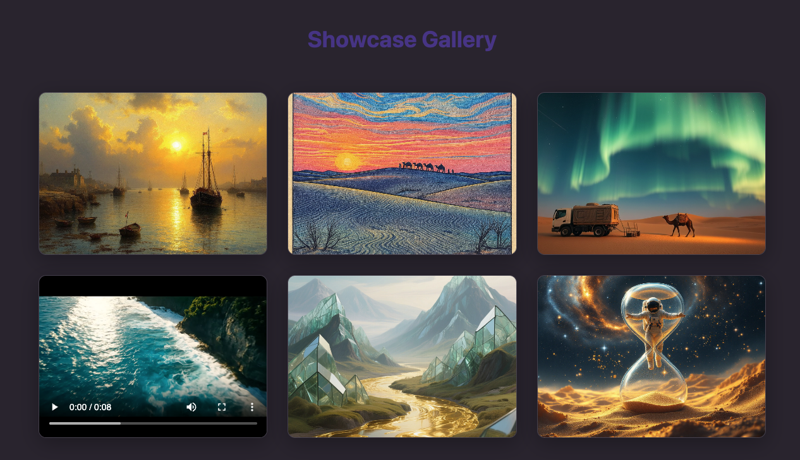

# Runware Media Generator

Runware Media Generator is a sleek React web application that showcases the power of AI-driven creativity through the Runware API
. Designed as part of the Graduate Roles Practical Assessment, this project demonstrates how developers can integrate cutting-edge AI models into a modern frontend experience.

## Features

- **Text-to-Image Generation**: Create high-quality images from text prompts using FLUX models
- **Image Editing**: Advanced inpainting and editing with SeedEdit 3.0 and Ideogram 3.0 Edit
- **Text-to-Video Generation**: Generate videos from text descriptions using Seedance 1.0 Lite and Veo 3 Fast
- **Real-time Processing**: WebSocket integration for live generation updates
- **Modern UI**: Clean, responsive interface with Tailwind CSS
- **Type Safety**: Full TypeScript implementation

## Screenshots



## Tech Stack

- **Frontend**: React 18, TypeScript, Tailwind CSS
- **Backend**: Supabase Edge Functions (Deno)
- **API**: Runware AI API (WebSocket & REST)
- **Icons**: Lucide React
- **Deployment**: Vercel (frontend), Supabase (backend functions)

## Getting Started

### Prerequisites

- Node.js 18+ 
- Supabase CLI
- Runware API key

### Installation

1. Clone the repository
```bash
git clone https://github.com/yourusername/runware-media-generator.git
cd runware-media-generator
npm install

Set up environment variables

bashcp .env.example .env.local
Add your API keys to .env.local:
REACT_APP_SUPABASE_URL=your_supabase_url
REACT_APP_SUPABASE_ANON_KEY=your_supabase_anon_key

Set up Supabase functions

bashsupabase functions deploy
supabase secrets set RUNWARE_API_KEY=your_runware_api_key

Start development server

bashnpm start
API Integration
This project demonstrates integration with multiple Runware models:

Image Generation: FLUX.1 Dev, FLUX.1 Schnell
Image Editing: SeedEdit 3.0, Ideogram 3.0 Edit
Video Generation: Seedance 1.0 Lite, Google Veo 3 Fast

Key Technical Decisions

Asynchronous Processing: Proper handling of video generation's async nature
WebSocket Communication: Real-time updates for generation progress
Error Handling: Comprehensive error states and user feedback
Type Safety: Full TypeScript coverage for API interactions

Project Structure
src/
├── components/          # React components
│   ├── ui/             # Reusable UI components
│   └── sections/       # Page sections
├── hooks/              # Custom React hooks
├── services/           # API service layers
├── types/              # TypeScript type definitions
└── utils/              # Utility functions

supabase/
└── functions/          # Edge functions for API proxy


